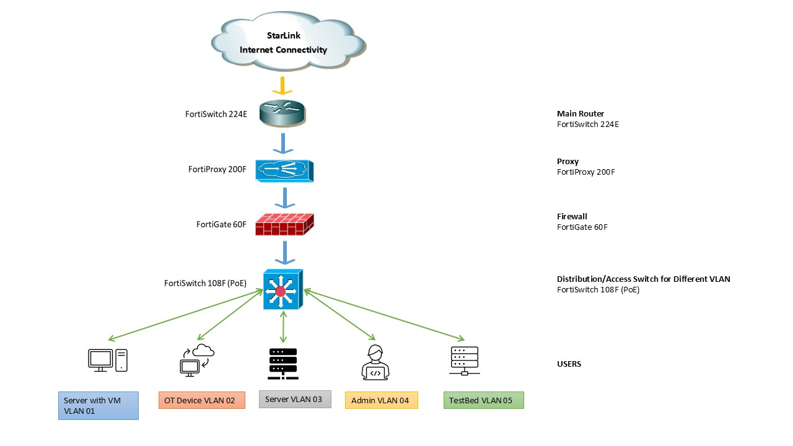

# IT/OT Cybersecurity Lab – Network Segmentation & Secure Architecture

Real-world IT/OT cybersecurity lab inspired by enterprise and industrial network environments.

---

## Overview
This project demonstrates a secure network segmentation design separating IT and OT (Operational Technology) environments using firewall policies, VLANs, and controlled communication pathways.

The objective is to simulate a real-world enterprise and industrial setup where security, isolation, and monitoring are critical.

---

## Architecture

- IT Network (User systems, enterprise services)
- OT Network (Simulated industrial/lab systems)
- Firewall Layer (FortiGate)
- VLAN-based segmentation
- Controlled communication between IT and OT zones

---

## Security Design

- Strict separation between IT and OT environments  
- Controlled access using firewall policies  
- Principle of least privilege  
- Reduced attack surface through segmentation  
- Monitoring and logging for visibility and incident response  

---

## Technologies Used

- FortiGate Firewall  
- VLAN segmentation  
- Network security policies  
- Monitoring and logging concepts  

---

## Use Cases

- Industrial Control System (ICS) environments  
- Enterprise and engineering network isolation  
- Research lab cybersecurity architecture  

---

## Future Enhancements

- SIEM integration for centralized logging  
- Intrusion detection and alerting  
- High availability (HA firewall setup)  
- Zero Trust network concepts  

---

## Author

Hossain Md Niaze Motaher  
IT Infrastructure & Security Engineer | CompTIA Security+
